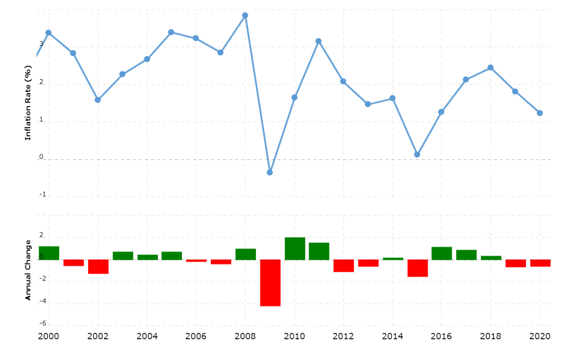

**BLUF:** TSP is an easy, low-fee way to invest.  If you are enrolled in the Blended Retirement System (BRS), you are losing money if you don’t invest 5%.  Compound interest at market average gains can double your money every 10 years, so invest as much as early as possible.  But, to do this right in TSP, you must change your contribution allocations and do an interfund transfer if needed. 

------

Let’s start by saying, if you are in the military and aren’t putting some money into your TSP… you are wrong.

Ok, that might be a bit strong, but the Thrift Savings Plan (TSP) is an easy, low-fee way of investing money while in the military or government service.  And, if you joined after 1 Jan 2018 (or opted into the Blended Retirement System), the government will match up to a total 5% of your basic pay.  **This is a guaranteed, immediate 100% return on your money.**  If you are eligible for matching, you are literally turning down free money if you aren’t investing enough to max this out.  

If you go into MyPay, you can allocate a percentage of your base pay to be invested every month.  For step-by-step instructions, please read this post entitled, "[How to Start Investing in the Thrift Savings Plan (TSP) Part One: Setup MyPay](https://www.militaryinvestor.org/How-to-Start-Investing-in-The-Thrift-Savings-Plan-TSP-Part-1-MyPay/).

Have you done that yet?  I’ll wait.

… 

…

Congratulations!  You've taken your first step towards investing in the TSP!  However, this is where most people stop. They just throw some money into Thrift Savings Plan, which is a good start.  **But, until you change your fund allocations in TSP, you are not making as much money as you should be! ** 

That’s right.  **By default, your money will go 100% into the _G Fund_**, which uses _low-yield, government-guaranteed securities_.  The return over the last 5- and 10-years has been an underwhelming 1.95%… less than the roughly 2-3% of inflation over that period (and **way** below [the massive 6.8% inflation in 2021](https://www.theguardian.com/business/2021/dec/10/us-inflation-rate-rise-2021-highest-increase-since-1982#:~:text=The%20US%20inflation%20rate%20rose,after%20rising%200.9%25%20in%20October.)).  Though you won’t lose your money, the best case scenario is that you barely avoid losing money vs. inflation with the G Fund.

_U.S. Inflation since 2000 ([source](https://www.macrotrends.net/countries/USA/united-states/inflation-rate-cpi))_

On the other hand, funds like the C Fund and S Fund (which track “Large Cap” large/mid-sized companies and “Small Cap” mid/small-sized companies, respectively) have about a 10% return over the same period.  Based on the recommendations of investing titans such as John Goble (founder of Vanguard), if some of your money isn’t growing, you are losing money.  

If you want to gain enough money to have a comfortable retirement, you need to invest in ways that allow you to take advantage of the magic of compound interest.  For example, at a 7% rate of growth (which is the average of the total stock market over the last century), an investment of $100,000 would roughly double to $200,000 in 10 years, and then double again to $400,000 in 20 years, and double again to $800,000 in 30 years.  Though returns are not guaranteed in the short term and previous performance does not guarantee future performance, these rates have borne out over the long term.

But, this is only possible if you are making at least a 7% return over the long term.  And, this is not mathematically likely if all your money is in the G Fund.  

----

If you aren't sure how your money in the TSP is invested, follow this step-by-step guide to fix that entitled "[How to Start Investing in the Thrift Savings Plan (TSP) Part Two: Change Your TSP Allocations](2021-12-12-How-to-Start-Investing-in-The-Thrift-Savings-Plan-TSP-Part-2-TSP-Allocations.md).

