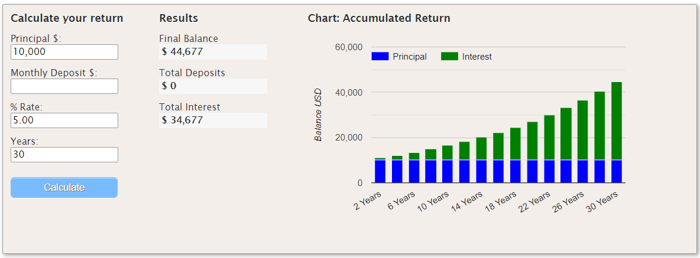

# Aggressively Cut Fees to Keep More of Your Profits

> “It’s not how much money you make, but how much money you keep, how hard it works for you, and how many generations you keep it for.”
> ROBERT T. KIYOSAKI, AUTHOR OF “RICH DAD POOR DAD”

Index investing is like catching water by holding a bucket outside in the rain.  You catch more rain the longer your bucket is in the rain.  Now, imagine that you have a hole in your bucket, and some of the water is slowly trickling out the bottom.  That is how fees work.  **The larger the fees on your investments, the more money is draining out of your pocket and into someone else’s.**

As the author of “Rich Dad Poor Dad”, Robert Kiyosaki, says, “It’s not how much money you make, but how much money you keep…”  This applies to fees and taxes, which can have a massive impact on your overall returns (and ultimately, how well off you are in retirement).

Without researching your investments, oftentimes you don’t know that you are paying very high fees.  For example, for years I had invested in USAA’s 529 college savings plans for my kids.  Like many others, I started investing in USAA’s 529s because I banked with them over the years.  However, after finally looking into the fees of this plan, I realized that it was charging far above what I should be. As a result, I’m doing a 529 rollover into a different plan with much lower fees. Note: Before rolling over a 529 into another state’s plan, make sure you understand the tax implications.

For example, USAA’s 529 plans (now managed by Victory Capital) charge up to 1.06% of your total assets for ages 0-2 in annual fees, [per their website](https://investor.vcm.com/products/usaa-529-college-savings-plan/usaa-529-college-savings-plan-details/usaa-529-college-savings-plan-performance). **For children who are 0-2 years old, this means that Victory Capital takes 1.06% of your total balance in fees each year.**  This is compared to investing in an Education Saving Account (ESA) with Schwab that charges 0% above the investments (many of which charge 0.04%-0.1% in costs).  Or, for an apples-to-apples comparison, Illinois’ [BrightStart 529 charges around 0.12% fees](https://www.brightstart.com/performance/daily/?portfolio=all) for many of their Age-Based investments.  This, and Illinois’ BrightStart also provides a huge state tax write-off for Illinois residents ([$10,000 per year, or $20,000 if married filing jointly](https://www.brightstart.com/tax-center/)).

#### Even 1% in Fees is a Big Deal!

So, what is the big deal with a 1% fee… it’s just 1%, right?  Look at it in a different light.  If your investment provides a 5% annual return, that 1% lowers your after-fees return to 4%.  So, basically, *that cuts your annual return by 20% each year… and those losses compound.*

Let’s show an example.  Pretend that you have $10,000 to invest for 30 years, and you earn a steady 5% return.  At the end of that period, your money will have grown to $44,677. You will have earned $34,677 in interest on your initial investment… not bad, right?

However, if you pay 1% in fees (reducing your return to 4%), in that same period your money will have only grown to $33,135.  That is a difference of $11,542, or a 33.2% loss of your compound gains! This shows that 1% is not just 1%. It can have a massive impact on your returns over the long run.

.png)

You can do your own comparisons here: [Compound Interest Calculator](http://www.helpfulcalculators.com/compound-interest-calculator).

#### Investment Fees

Though the math seems a bit strange initially, the results are not.  *Fees take serious money out of your pocket and put it in someone else’s.*  So, how do you stop this?  Reduce fees in your investments.

Firstly, the company you buy your investments through can charge you fees.  This is especially true for bundled insurance or annuity products (like whole life insurance, which can charge 90%+ in fees for the first 10-15 years), but also for college savings accounts (like 529s or ESAs) and even brokerage or IRAs.  Because there are many low- or even zero-fee options for investing (like Schwab, Vanguard, TD Ameritrade, etc.), find the lowest fee options for your investments.  

Second, look at what investments you are purchasing in these accounts.  Before investing, you need to look at each investments’ fees. For most mutual funds and ETFs, you can look up the information online.  Look for the _expense ratio_ (annual fee) and _load_ (up-front fee).  For example, googling the [Schwab Total Stock Market Index Fund (SWTSX)](https://www.google.com/finance/quote/SWTSX:MUTF?sa=X&ved=2ahUKEwjug9-4vYvzAhXVLs0KHVzJDkYQ3ecFegQIDRAR&window=1M) will show you that it charges a 0.03% expense ratio (fee) and has no front end load.  

Typically, _no-load low-fee total market index funds_ have the lowest fees.  Many total market index funds and ETFs – including those from Vanguard, Schwab, and others – charge around 0.03-0.04%.  Other _sector_ index funds (that concentrate on smaller sections of the markets such as real estate, technology, or international stocks) have somewhat higher fees.  **However, avoid any funds that have loads, or have expense ratios above 0.1%.** 

Thirdly, you have to address the largest fees of all – taxes.  By buying investments in tax-advantaged accounts – such as Roth IRAs or traditional IRAs – you can minimize or delay the taxes you pay.  In the case of Roth IRAs, you invest after-tax dollars, but you also avoid all taxes on the gains (including dividends) on your investments, which can equal a major tax advantage ([as long as you meet the maximum income limits to contribute into one](https://www.irs.gov/retirement-plans/amount-of-roth-ira-contributions-that-you-can-make-for-2021)).  I’ll cover this more in future posts.  

In the end, it isn’t what you make, it is what you keep.  Minimize fees to keep more of your gains.  Just a little research upfront could add thousands (or more) to your accounts in retirement. 

Take the time… your future self will thank you.
