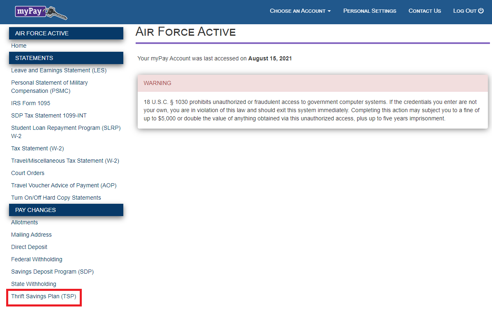
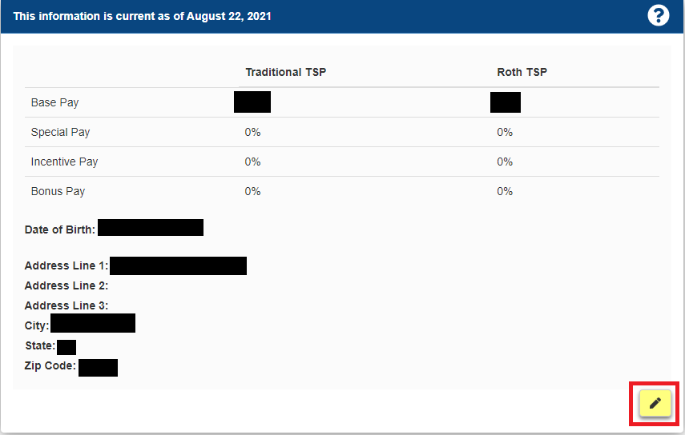
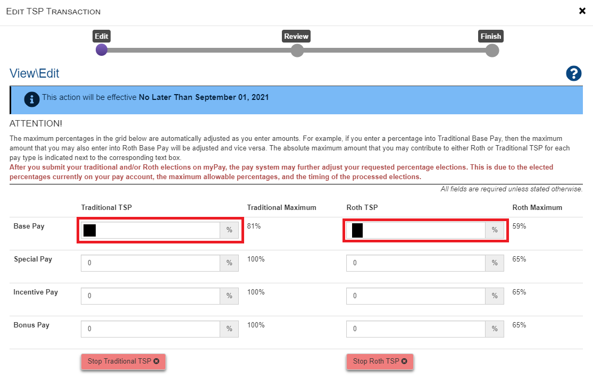
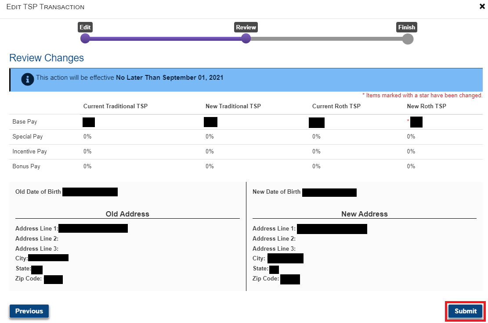

# How to Start Investing in the Thrift Savings Plan (TSP) Part One: A Step By Step Guide to Setup MyPay

To start investing in the Thrift Savings Plan (TSP), the first step is to setup your contributions in [My Pay](https://mypay.dfas.mil/).

_To get started, log into MyPay, then click the “Thrift Savings Plan” link (on the bottom-left)._

_This will show you the current percentages you are investing.  If you haven’t started, they will all show as 0%.  To change these percentages, click the yellow pen button (in the bottom-right)._

_You can edit how much you are investing into TSP each month here.  For now, put a 1% into the block next to “Base Pay” and under “Roth TSP”.  Then, scroll all the way down and click the “Continue” button (on the bottom-right)._

_On the next screen, you can review your changes.  When you are ready, click “Submit”._  

Congratulations!  Money will start coming out of your next check. More importantly, you have just started investing in your future!

------------------

After this, you'll need to pick how your money will be invested in the TSP.  To do this, [please continue reading Part 2 of this series to learn how to change how your money is invested in the TSP](2021-12-12-How-to-Start-Investing-in-The-Thrift-Savings-Plan-TSP-Part-2-TSP-Allocations.md).

