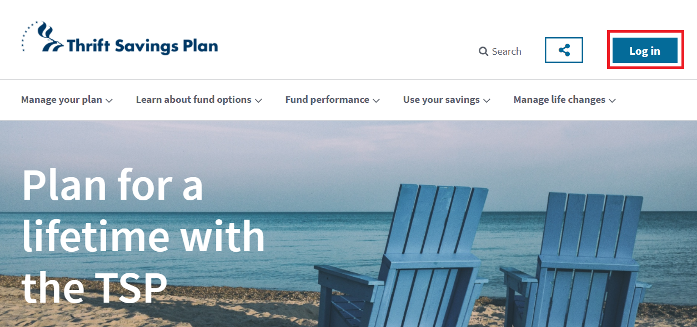
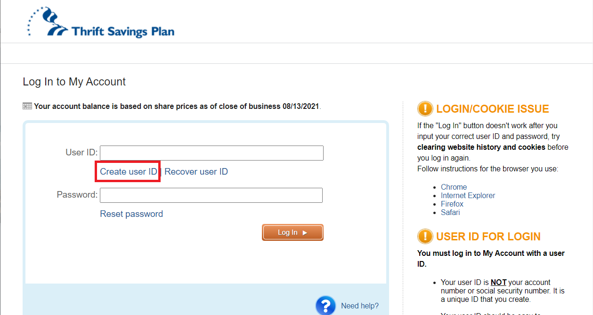
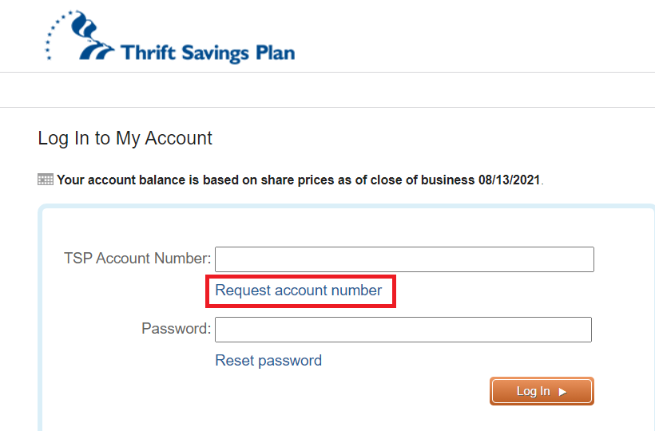
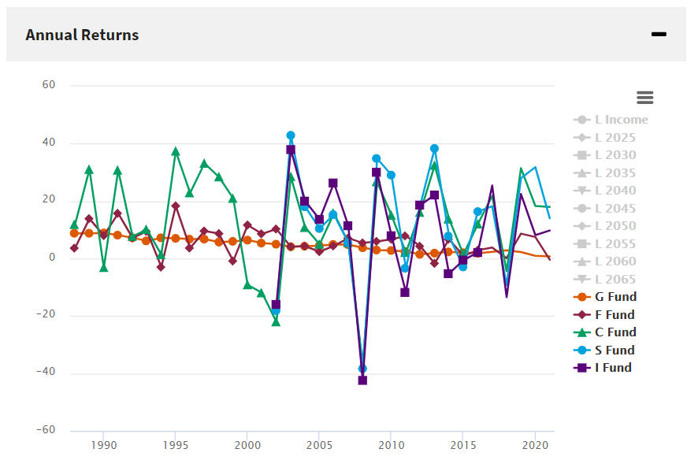
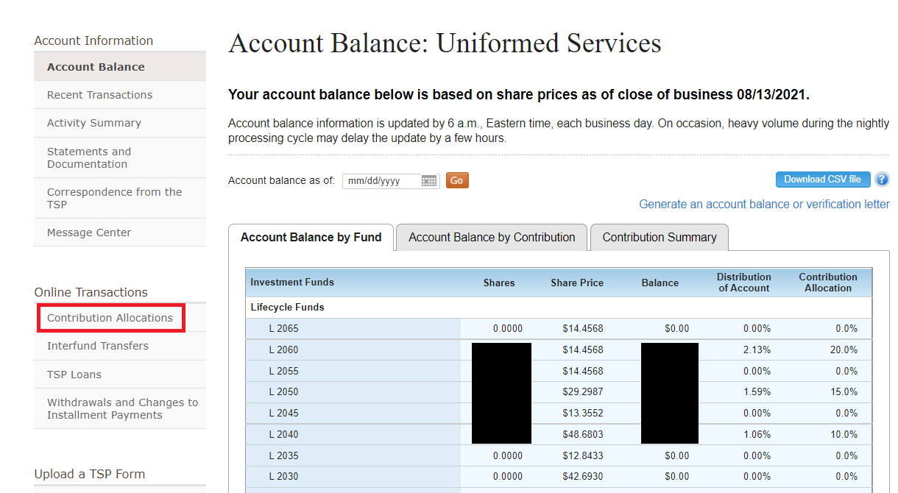
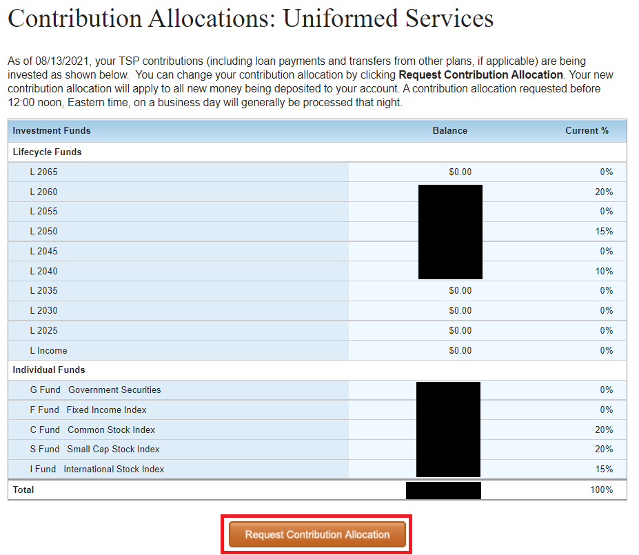
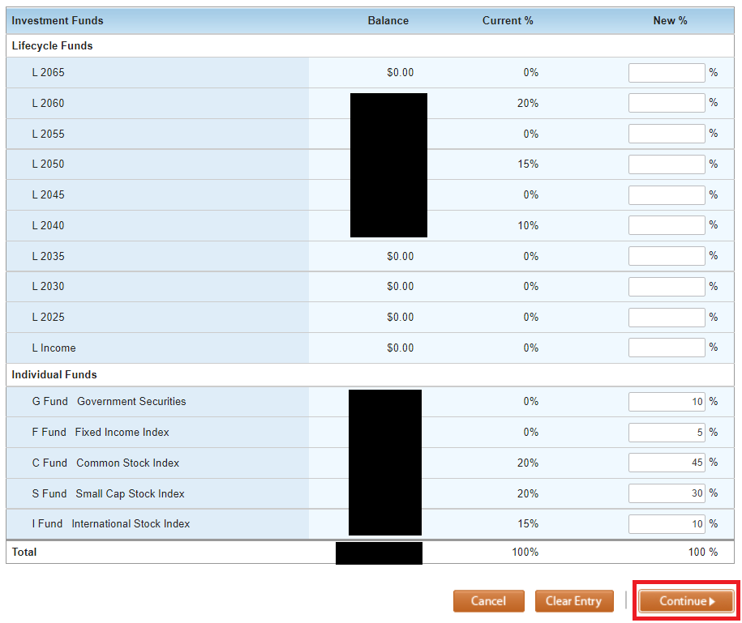
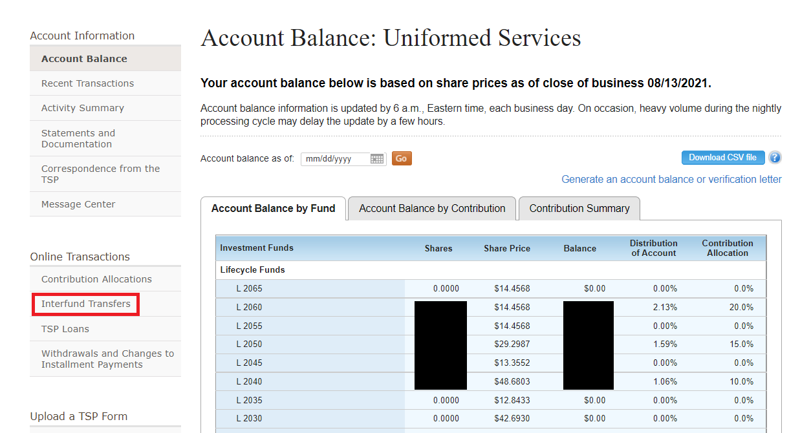
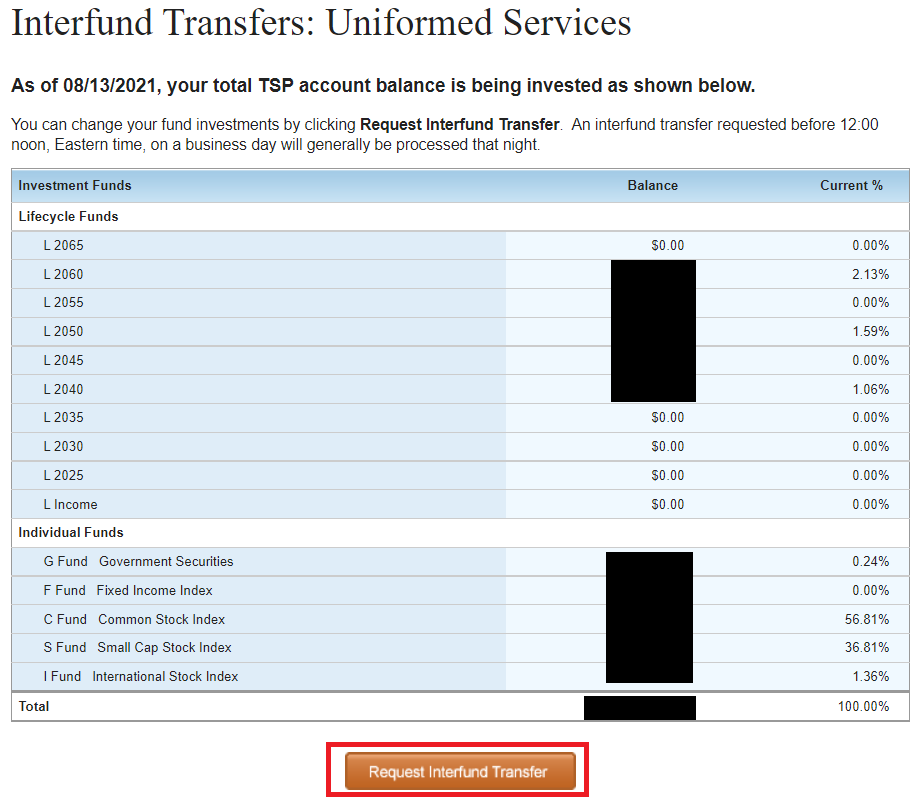
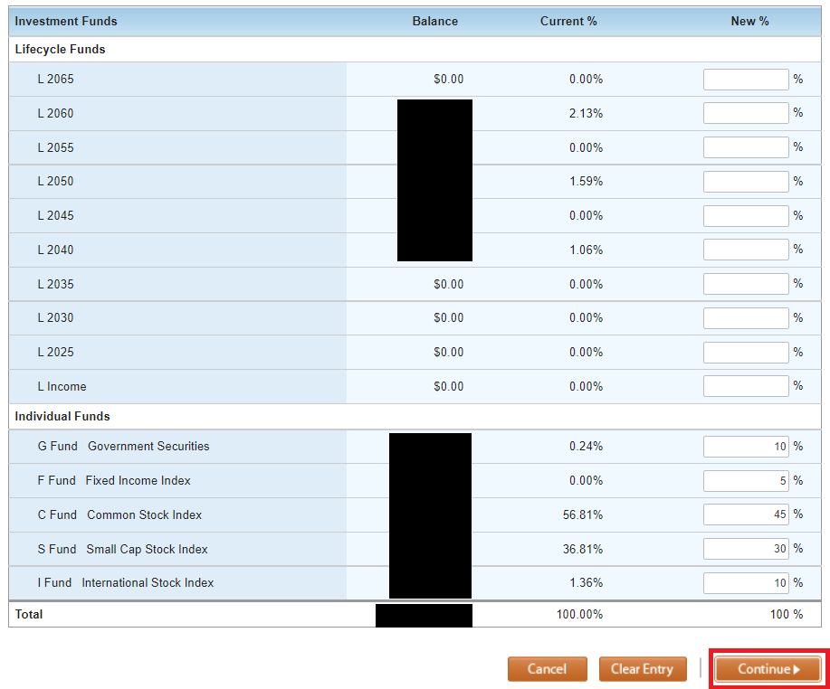

# How to Start Investing in the Thrift Savings Plan (TSP) Part Two: A Step By Step Guide to Change Your TSP Allocations

If you followed the steps in Part 1, you've already setup your MyPay to transfer some of your paychecks in your TSP! **ADD LINK TO PART 2**

If so, congrats!  You've taken your first step towards investing in the TSP!  However, this is where most people stop. They just throw some money into Thrift Savings Plan, which is a good start.  **But, until you change your fund allocations in TSP, you are not making as much money as you should be! **  

By default, your money is going into the _G Fund_ in TSP... which isn't going to help you build the wealth you need.  If you haven't already, please [read my post on why you shouldn't leave your money (only) in the G Fund](https://www.militaryinvestor.org/Don't-Leave-Your-TSP-Money-Only-in-The-G-Fund/).

----------

Ok, so let's finish setting up your TSP.  Just follow these steps:

1. First, you need to go to https://tsp.gov and log in. Start by clicking the “Log In” button shown here.

1.A – If you already have a login, use it. If not, click on the “Create user ID” link.

1.B – If you have something with your TSP account number (it would’ve come via snail mail), use it here to create your username. If not, click the “Request account number”.

.png)
1.C. – If you don’t have your TSP account number or a login, then enter your social security number here. They will mail you a letter with your account number, which should arrive in 3-5 business days. Sorry, you’ll have to wait a week to finish the rest of our steps, but don’t give up!

.png)
2. Ok, so you are logged into TSP. You should notice a page like this, with percentages and numbers.

.png)
3. In this table, your Balance is the amount of money invested into each TSP fund, with the Total at the bottom. Your Distribution of Account shows what percentage of your money is invested in each fund right now. Your Contribution Allocation shows what percentage of future funds you invest will go into each fund.

**————– BREAK BREAK ————**

**Investment allocation is perhaps the most important decision you make as an investor.** Generally, investing in index funds (like the TSP funds) is a good way to reduce risk through diversification (vs. buying individual stocks or bonds). That way, if one stock or bond goes down, you don’t lose your shirt.

You should do your own research on the funds and find out what works best for you. However, here is some general information about each fund, and their performance over the last 10 years:

[G Fund](https://www.tsp.gov/funds-individual/g-fund/) (Low-risk U.S. Treasury securities) – 1.95%
[F Fund](https://www.tsp.gov/funds-individual/f-fund/) (U.S. Bond Index Fund) – 3.58%
[C Fund](https://www.tsp.gov/funds-individual/c-fund/) (Large Company/S&P 500 Index Fund) – 15.37%
[S Fund](https://www.tsp.gov/funds-individual/s-fund/) (Small Company/Down Jones Index Fund) – 14.39%
[I Fund](https://www.tsp.gov/funds-individual/i-fund/) (International Index Fund) – 6.48%

_Graph of performance (gains & losses) over the last 30 years for each fund ([source](https://www.tsp.gov/fund-performance/)). Note: though the C/S/I funds have much higher returns than G/F, they are wildly volatile. They go up massively in a “bull market”, but drop a ton in a “bear market”. Factor risk into your decision._

I’ll dig into this more in a future post, but there are dozens of theories about how to balance the risky growth of stock index funds and the more stable/lower growth of bond index funds. An 80%/20% split is considered highly risky, while a 50%/50% split is considered conservative.

Including my wife’s TSP (which is all in the G Fund…), we are split roughly 75% stocks/25% bonds (and too much crypto). However, we are over 30 years away from retirement, and have time to recover from any major dips in the market.

Alternatively, you can also invest in the [Lifecycle Funds](https://www.tsp.gov/funds-lifecycle/). As a rule of thumb, pick Lifecycle funds with the year that you are planning to start taking out funds. So, if you are planning to retire in roughly 2050, invest money into the “L 2050” fund. The TSP folks will automatically adjust your investments between the 5 funds over time, slowly increasing your stake in low-risk G/F Funds as your approach retirement.

**Again, do your own research, or ask a professional!**

**————– BREAK BREAK ————**

Ok, so you want to adjust how your Thrift Savings Plan will be invested? Let’s get continue.

4. To get started adjusting your Contribution Allocations (i.e. where new money will be invested), click on the “Contribution Allocations” link on the left

5. The next screen will show you your current Contribution Allocations. These percentages show what amount of your money will go to each fund. If you want to change these percentages, click the “Request Contribution Allocation” button at the bottom.

6. Fill in the percentages on the right. They will have to add up to 100%. The numbers above represent an extremely aggressive/risky distribution. If you are super confused, you can always put everything in Lifecycle Funds (use the year you are planning to start pulling out retirement funds) and let TSP manage the distributions for you.

You can always change these numbers later as you learn more about investing, so make a judgement call and press “Continue”.

You should get a confirmation message. If so, you’ve just adjusted your Contribution Allocations!

7. Next, if you already have a lot of money just in the G Fund (and you want to adjust where your currently money is invested), click on the “Interfund Transfers” link on the left.

8. Again, you’ll get a breakdown of where your money is currently invested. If you want to continue, click the Request Interfund Transfer button at the bottom.

9. Fill in the numbers on the right to decide where you want your current money to be invested. Once you are satisfied, click “Continue”. If everything worked, then you should have a confirmation page.

------------

And, that’s it. By adjusting your investments, you can help shape how your money grows, and diversify your investments to beat inflation.

Congratulations!
