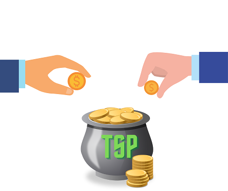
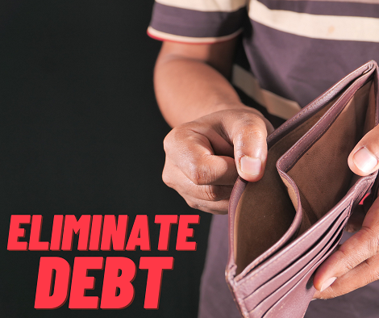
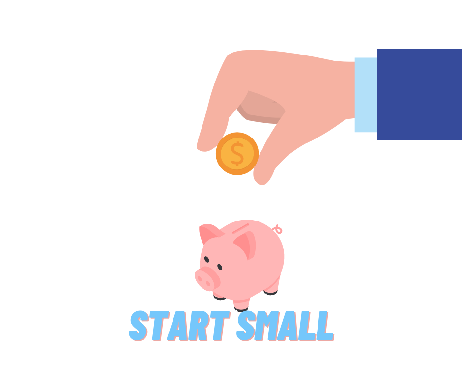
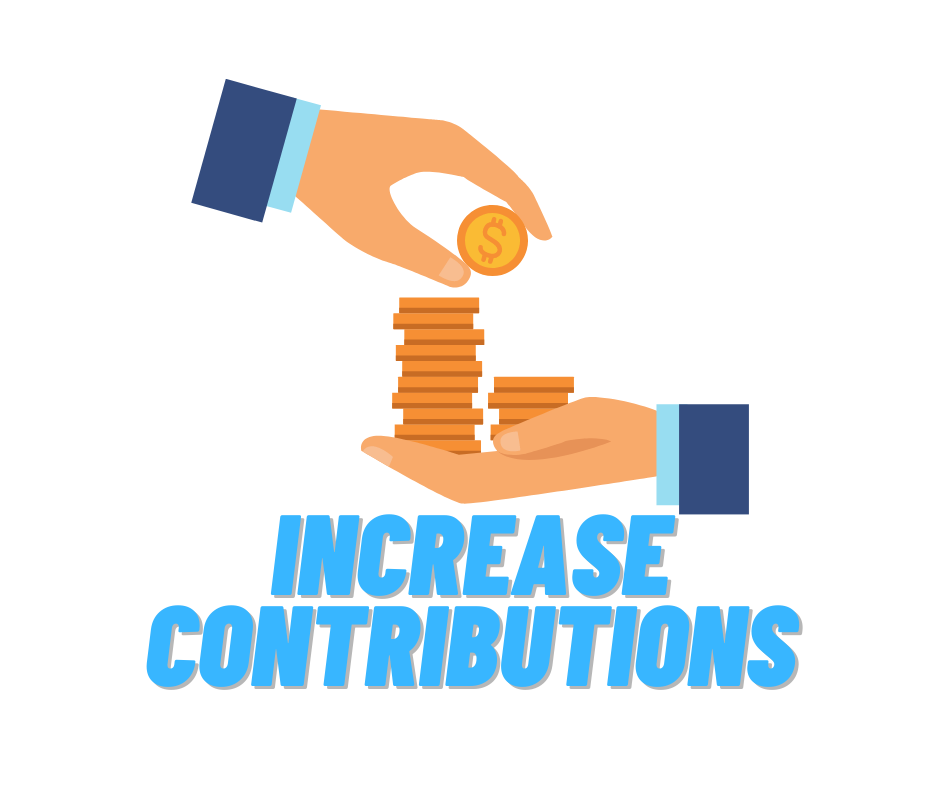

> “Investing is not nearly as difficult as it looks. Successful investing involves doing a few things right and avoiding serious mistakes.”
> John C. “Jack” Bogle, Founder of Vanguard

**BLUF:** Here are my 7 steps to military investing. Get your TSP matching and eliminate consumer debts. Then, start small (1%) and buy Lifecycle funds (in TSP) or _no-load, low-cost total market index funds_ (in an IRA or Roth IRA). Step up your investments each month, and diversify. Then, keep buying and holding… and don’t panic sell!

_Updated: 17 Dec 2021_

*[TSP]: Thrift Savings Plan

Investing can be complicated. But, the truth is that you don’t have to rely on complicated investment strategies to build a nest egg for your future. By following a simple passive investing method, you can slowly and steadily create wealth. Investing in index funds can allow your money to grow much faster than inflation (over the long term) through the magic of compound interest.

For this article, I’ll outline the steps to simple investing. Then, over the next few weeks I’ll write up explanations for the different technical terms being used (for those who are interested). Read the ones you want, but know that this is the plan that I use myself.

First, a disclaimer: **I am not a financial advisor, and I’m definitely not your financial advisor.** These are steps I’ve learned from others much more knowledgeable than myself, and are the principles that I practice myself. How you invest will depend a lot on your personal situation – like how soon you’ll need money for retirement, or for big expenses like college or home purchases. But, these guidelines provide a good baseline for most military investors.

#### The steps:
1. [Maximize your TSP matching](#step-1)
2. [Eliminate your consumer debts](#step-2)
3. [Start investing small (1%)](#step-3)
4. [Buy investments](#step-4)
5. [Increase your monthly contributions](#step-5)
6. [Diversify](#step-6)
7. [Keep buying and holding… don’t panic sell!](#step-7)

----------

### Step 1: Maximize your TSP matching 

Tip: Invest enough to get your full matching contribution and continue to the next step.

If you joined in 2018 or later or opted into the Blended Retirement System (BRS), the government will match your contributions when you invest in TSP ([up to 5% of your base pay](https://www.tsp.gov/publications/tspfs01.pdf)).  Basically, they put free money in your TSP account when you invest.  **If you aren't maxing this out, you are missing out on 100% risk-free money!**  (For veterans who receive matching from their company's 401K, the same rule applies.)

For more explanation, read more about [Maximizing Your TSP Matching](https://www.militaryinvestor.org/Step-1-Maximize-TSP-Matching/).

----------

### Step 2: Eliminate your consumer debts 

Tip: Use the _debt snowball_ to pay off all of your consumer debt except for your mortgage (i.e. credit cards, personal loans, car payments, etc.).  

If you are paying 12% interest on a credit card, earning 7% (on average) from your index funds is not going to help you.  List all of your debts (in order from smallest debt to largest – regardless of interest rate). Then, pay off the smallest debt as fast as you can. Then, attack the second smallest. And continue until they are all gone.

For more explanation, read more about [Eliminating Your Consumer Debts](https://www.militaryinvestor.org/Step-2-Eliminate-Consumer-Debts/).

----------

### Step 3: Start investing small (1%)

Tip: Start investing a tiny amount right now!  If you don't know where to start, invest in your Thrift Savings Plan (TSP).  If you aren't eligible to use the TSP, start a Roth Individual Retirement Account (Roth IRA).

The most important thing you can do to build wealth is start today!  The most important thing is starting as soon as possible, as the _magic of compound interest_ creates large returns over the long run.  If you are in the military or government service, I'd recommend the Thrift Savings Plan (TSP).  It is the easiest way to start, and you can invest more money than in a Roth IRA ([$20,500/year](https://www.tsp.gov/makingcontributions/contribution-limits/) vs. [$6,000/year](https://www.irs.gov/retirement-plans/plan-participant-employee/retirement-topics-ira-contribution-limits)).

For more explanation, read more about how to [Start Investing Small (1%)](https://www.militaryinvestor.org/Step-3-Start-Small/).

----------

### Step 4: Buy Investments (TSP Funds & Index Funds)

Tip: Once you have money in your investment accounts, start buying TSP Funds or Index Funds.

In a TSP, the easiest way to start is to buy Lifecycle "L" Funds.  In an IRA or Roth-IRA, buy _No-Load, Low-Fee Total Market Index Funds_.

For more explanation, read more about how to [Buy Investments](https://www.militaryinvestor.org/Step-4-Buy-Investments/).

----------

### Step 5: Increase Your Contributions

Tip: Increase your contributions each month until you reach 15% (or more, if you started late).  

Increase your contributions by 1% (or more) every month until you can’t sustain it anymore financially. Then, as you get pay raises or other income, invest that as well. Keep going until you hit 15% of your income every month invested.  The sooner you start, the more your investments will grow.

For more explanation, read more about how to [Increase Your Investments](https://www.militaryinvestor.org/Step-5-Increase-Investments/).

---------

### Step 6: Diversify

Tip: _Diversify_ (i.e. buy lots of different types of investments) to lower the risk of a market downturn.

Once you've started to build your nest egg, you'll need to diversify.  Market down turns can cut your nest egg quickly. Though the U.S. stock market has always bounced back stronger, one way to mitigate the effects of a market crash is to buy different types of investments.

For my take on diversification, read more on how to [Diversify](https://www.militaryinvestor.org/Step-6-Diversify/).

---------

### Step 7: Keep Buying and Holding… Don’t Panic Sell!

Tip: Don't panic when the market drops.  Continue buying and holding until you retire.

This is perhaps the most important step of all. At this point, you are investing a significant part of your income, and building a nice diversified nest egg for retirement. However, eventually there will downturns in the market.  But, the longest downturn in U.S. history (the Great Depression) only lasted 3.5 years.  And, even with downturns such as this, the market has gained ~7% over the long term.  As long as you are far from retirement, the smart play is to stay invested.

For more explanation, read more on why to [Keep Buying and Holding](https://www.militaryinvestor.org/Step-7-Buy-and-Hold/).

-------

If you've followed these instructions you are on your way to building wealth for yourself and your family over the long term.  If you have any questions or concerns, please reach out in the comments.
