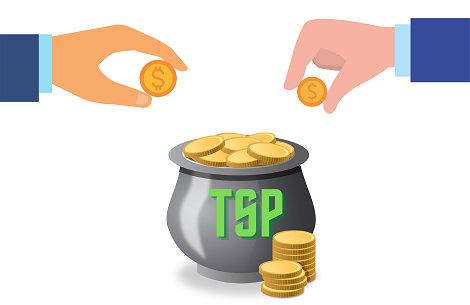

> “Investing is not nearly as difficult as it looks. Successful investing involves doing a few things right and avoiding serious mistakes.”
> John C. “Jack” Bogle, Founder of Vanguard

**BLUF:** Here are my 7 steps to military investing. Get your TSP matching and eliminate consumer debts. Then, start small (1%) and buy Lifecycle funds (in TSP) or _no-load, low-cost total market index funds_ (in an IRA or Roth IRA). Step up your investments each month, and diversify. Then, keep buying and holding… and don’t panic sell!

_Updated: 17 Dec 2021_

Investing can be complicated. But, the truth is that you don’t have to rely on complicated investment strategies to build a nest egg for your future. By following a simple passive investing method, you can slowly and steadily create wealth. Investing in index funds can allow your money to grow much faster than inflation (over the long term) through the magic of compound interest.

For this article, I’ll outline the steps to simple investing. Then, over the next few weeks I’ll write up explanations for the different technical terms being used (for those who are interested). Read the ones you want, but know that this is the plan that I use myself.

First, a disclaimer: **I am not a financial advisor, and I’m definitely not your financial advisor.** These are steps I’ve learned from others much more knowledgeable than myself, and are the principles that I practice myself. How you invest will depend a lot on your personal situation – like how soon you’ll need money for retirement, or for big expenses like college or home purchases. But, these guidelines provide a good baseline for most military investors.

#### The steps:
1. Maximize your TSP matching
2. Eliminate your consumer debts
3. Start investing small (1%)
4. Buy investments
5. Increase your monthly contributions
6. Diversify
7. Keep buying and holding… don’t panic sell!

### Step 1: Maximize your TSP matching 

Tip: Invest enough to get your full matching contribution and continue to the next step.

If you joined in 2018 or later or opted into the Blended Retirement System (BRS), the government will match your contributions when you invest in TSP ([up to 5% of your base pay](https://www.tsp.gov/publications/tspfs01.pdf)).  Basically, they put free money in your TSP account when you invest.  **If you aren't maxing this out, you are missing out on 100% risk-free money!**  (For veterans who receive matching from their company's 401K, the same rule applies.)

For more explanation, read more about [Maximizing Your TSP Matching](https://www.militaryinvestor.org/Step-1-Maximize-TSP-Matching/).

### Step 2: Eliminate your consumer debts 

Tip: Use the _debt snowball_ to pay off all of your consumer debt except for your mortgage (i.e. credit cards, personal loans, car payments, etc.).  

If you are paying 12% interest on a credit card, earning 7% (on average) from your index funds is not going to help you.  List all of your debts (in order from smallest debt to largest – regardless of interest rate). Then, pay off the smallest debt as fast as you can. Then, attack the second smallest. And continue until they are all gone.

For more explanation, read more about [Eliminating Your Consumer Debts](https://www.militaryinvestor.org/Step-2-Eliminate-Consumer-Debts/).

### Step 3: Start investing small (1%)

Tip: Start investing a tiny amount right now!  If you don't know where to start, invest in your Thrift Savings Plan (TSP).  If you aren't eligible to use the TSP, start a Roth Individual Retirement Account (Roth IRA).

The most important thing you can do to build wealth is start today!  The most important thing is starting as soon as possible, as the _magic of compound interest_ creates large returns over the long run.  If you are in the military or government service, I'd recommend the Thrift Savings Plan (TSP).  It is the easiest way to start, and you can invest more money than in a Roth IRA ([$20,500/year](https://www.tsp.gov/makingcontributions/contribution-limits/) vs. [$6,000/year](https://www.irs.gov/retirement-plans/plan-participant-employee/retirement-topics-ira-contribution-limits).

For more explanation, read more about how to [Start Investing Small (1%)](https://www.militaryinvestor.org/Step-3-Start-Small/).

### Step 4: Buy Investments

Once you have money in your investment accounts – either in the TSP or an IRA or Roth-IRA – it’s time to invest. We will do this by buying index funds.

#### Step 4A: In the TSP, buy Lifecycle funds:

In TSP, the easiest way to get started is to buy a Lifecycle, or L Fund. These funds give you a diversified mix of the TSP’s index funds (the C, S, I, F, and G funds) and slowly balances them out over time as you get closer to retirement.

If you have many years until retirement, do not pick the “L Income” fund. That fund is meant for people who are retired right now. It holds a large amount of low-risk but low-reward funds (like G fund) that is not right for someone with decades left before retirement.

You can get fancier, but the L Funds are a good place to start. I personally like to buy the individual funds, as I like the flexibility of deciding my ratios of stock index funds (C, S, and I funds), bond index funds (F fund), and low-risk government securities (G fund) I want to hold. **However, the most important thing is to get your money invested so it can start working for you.**

For more step-by-step directions on how to allocate your funds in the TSP, please check out my previous post, “[Don’t leave your TSP investments (only) in the G Fund](https://www.militaryinvestor.org/Don't-Leave-Your-TSP-Money-Only-in-The-G-Fund/)”.

#### Step 4B: In an IRA or Roth-IRA, buy _no-load, low-fee total market index funds_

If you have money in your IRA or Roth-IRA account, then you can start buying funds. You have nearly every possible investment at your finger tips, which is both a blessing and a curse. Too many options make it hard to decide. Hopefully I can help narrow down your options.

Based on what I’ve learned so far, the majority of your investments should be in no-load, low-fee total market index funds. Let’s break down what this is:

- No-load: There is no upfront costs to buy shares in this index fund
- Low-fee: All index funds charge an annual fee (to pay for managing the fund). However, these fees can greatly reduce the amount you get to keep.
- Total Market Index fund: Basically, this fund invests in the whole market. These funds passively buys stocks based on their proportion of the market (if Apple is 2% of the market, 2% of its holdings are Apple). As a result, these funds are diversified across the whole stock market, making them much less volatile and risky than trying to pick individual stocks. In a world where the majority of active fund managers fail to match the returns of these passively managed funds, total market index funds are usually a better bet than picking individual stocks.

There are a number of ETFs and index mutual funds that meet this criteria. Here are a few that I’ve found:
- [VTI](https://investor.vanguard.com/etf/profile/fees/vti) – Vanguard’s total market index ETF. It charges 0.03%/year in fees, with no load. Vanguard is also the company that created index funds, so they have a solid reputation in this space.
- [VTSAX](https://investor.vanguard.com/mutual-funds/profile/vtsax) – Vanguard’s Total Stock Market Index Fund Admiral Shares. Charges 0.04%/year in fees, with no load. This is a mutual fund vs. an ETF.
- [SWTSX](https://www.schwab.com/research/mutual-funds/quotes/fees/swtsx) – Schwab’s Total Stock Market Index mutual fund. It charges 0.03%/year in fees with no load.

**Note: One thing I’ve learned is that though these funds do not charge an initial fee, your brokerage company may charge a fee for mutual funds from other companies.** For example, Schwab doesn’t charge a fee to buy their own mutual funds, but does for other company’s mutual funds (like Vanguard). Take this into account when you are deciding which company to open your accounts with.

### Step 5: Increase Your Contributions
Next, you need to increase the amount you contribute each month. Saving 1% of your money will not be enough. For a traditional retirement, saving approximately 15% of your total gross income is a good recommendation (or more, if you started late in life). So, if you have 1% coming out of your paycheck, you need to ramp that up.

My recommendation: Increase your contributions by 1% (or more) every month until you can’t sustain it anymore financially. Then, as you get pay raises or other income, invest that as well. Keep going until you hit 15% of your income every
month invested.

#### Time is your friend
The more you invest – and the earlier you invest it – the more gains you should receive. The impact of more time can be astronomical. 

The earlier you invest, the more likely that compound interest will exponentially increase your money. As a rule of thumb, at a 7% return on investment (which the total market has sustained through its existence) your money would double roughly every decade. In a perfect world, you could invest $10,000 and it would double to $20,000 in 10 years. Then, that money
would double again (to $40,000) in 20 years. And again (to $80,000) in 30 years. And, to an astounding $160,000 after 40 years. All without investing another dollar.

But, most of us don’t have $10,000 just laying around. For the rest of us, you’ll need to invest consistently throughout your working years. The amount you save and invest will determine how comfortable of a retirement you will be able to have.

From decade to decade, the rate of return may change. There may be a major market crash that shrinks your nest egg, or a major bull market that creates explosive growth. However, if you have a long time horizon (i.e. a long time until you need to retire), you can ride those waves to a fairly predictable 6-7% gain over the long term… as long as you buy and hold. And, as long as you continue to buy, even when the market is going down.

### Step 6: Diversify
Once you’ve started to build a significant nest egg, you’ll need to diversify further. Market down turns can cut your nest egg quickly. Though the U.S. stock market has always bounced back stronger, one way to mitigate the effects of a market crash is to buy different types of investments.

Recommendations I’ve read concerning how much stocks vs. bonds to hold are all over the place. Some writers that a 80% stocks/20% bonds ratio is a good ratio (if a little aggressive) for most younger investors. Then, recommend a mix of 65% stocks/35% bonds as you approach retirement age (55-70 years old). Then, finally, a 50% stocks/50% bonds splits when you are at retirement age (70 years and older) and selling off parts of your investments for your living expenses. This way,
a portion of your investments are still growing even as you are retired.

However, largely based on recommendations from “[The Bogleheads’ Guide to Investing](https://www.amazon.com/gp/product/1118921283/ref=as_li_tl?ie=UTF8&camp=1789&creative=9325&creativeASIN=1118921283&linkCode=as2&tag=militaryinv09-20&linkId=ab2c899a82665729806bbe54bcfe9429),” I’m currently using the following allocations for myself.

**For TSP:**

This is a fairly conservative distribution, but based on my age (nearly 40) my intent is to add more safety to my investments for the future. Though younger investors should typically invest more heavily in stocks (i.e. C/S/I Funds and total market/international index funds) vs. bonds and government securities, I wanted less risk in my portfolio:
- 35% in C Fund (U.S. large company index fund)
- 15% in S Fund (U.S. mid/small company index fund)
- 15% in I Fund (International index fund)
- 15% in F Fund (Bond market index fund)
- 20% in G Fund (Risk-free, low-yield government securities)

**For Roth IRA:**

My distribution is nearly the same for my Roth IRA (though, I included a percentage of Real Estate Investment Trusts, or REITs):
- 50% in U.S. Total Market Index Funds
- 15% in International Index Funds
- 10% in Total Bond Market Fund
- 5% in Real Estate Investment Trusts (REITs)
- 20% in Treasury Inflation Protection Securities (TIPS)

In this distribution, my allocations are largely the same. The main differences is that instead of 15% Bonds, I am also purchasing 5% of Real Estate Investment Trusts (REITs). These securities pay dividends from the profits of hundreds of rental properties, or mortgages. I’ve included them because they provide a little more diversity to my portfolio. Finally, because there is no equivalent to the G Fund, I’ve included 20% of an index fund of Treasury Inflation Protected Securities (TIPs) to fulfill the same purpose. Though they are not “no risk” like the G Fund, they are guaranteed to track the rate of inflation with minimal potential for loss.

**_Of course, your allocations are an important personal decision, so please make your own judgements._** If you are younger, you’ll want to be more aggressive. If you are closer to retirement, you’ll want to be much more conservative.

#### Step 6A: Bonds
The standard hedge against the volatility of stocks are bonds. These are loans to the federal, state, or local/municipal governments, or to companies, that pay dividends back to the holders of these loans. They have different payback periods,
and the longer the loan period, the larger the return.

For those who are not interested in investigating the best bonds to buy, bond index funds are your friend. They operate like stock index funds (like were recommended in step 4), but with collections of bonds.

Here are some examples (though, do your own research):
- [VBTLX](https://investor.vanguard.com/mutual-funds/profile/VBTLX) – Vanguard Total Bond Market Index Fund
- [BND](https://investor.vanguard.com/etf/profile/BND) – Vanguard Total Bond Market ETF
- [SWAGX](https://www.morningstar.com/funds/xnas/swagx/quote) – Schwab U.S. Aggregate Bond Market Fund

#### Step 6B: Other Investment Types

There are lots of other ways to diversify your holdings beyond just paper assets like stocks and bonds.

**Real Estate** (i.e. buying a house, or rental property) does not follow the stock market, and is therefore a good investment for diversification. In addition, the price of real estate tends to outpace inflation by a wide margin. However, do your homework. There are tons of pitfalls, especially as military members. Buying a house and then PCS’ing to another base can make it difficult to sell in a slow market. And, being an out-of-state landlord can be a very costly, and perhaps even unprofitable, business model.

**Real Estate Investment Trusts (REITs)** are funds that trade like stocks, but represent collections of real estate. REITs pay a huge amount of dividends, as they are required to pay 90% of their profits each year as dividends to their stockholders. However, these investments can be very risky, and require digging into the financials of the companies. Also, beware of expense ratios, as even a small percentage (i.e. 0.2% or higher) can cut deep into your profits. There are also a few index funds for REITs that provide a little more diversity than buying individual REITs, including Schwab’s [SCHH](https://www.morningstar.com/etfs/arcx/schh/quote).

**Cryptocurrencies** like Bitcoin and Dogecoin are the “wild west” of speculative investments (i.e. gambles). The gambler and technology-enthusiast in me loves cryptocurrency, as there is a huge upside to these assets. However, they are way, way riskier than stocks. I’ll write an article that highlights the strengths and weaknesses of crypto speculation. If you are unfamiliar, be wary… and don’t invest more than what you are willing to lose. If you pick the wrong crypto, you could lose 100% of your investment.

**Entrepreneurship / Side Hustles** are other ways to generate additional returns on your investment dollars. Investing in your own business or side hustle can be a great way to create additional revenue, open up new tax benefits, and potentially allow you to add revenue into your other investments.

### Step 7: Keep Buying and Holding… Don’t Panic Sell!
This is perhaps the most important step of all. At this point, you are investing a significant part of your income, and building a nice diversified nest egg for retirement. However, it is inevitable that there will be a bad day in the stock market. Or, a major event will happen (like market crash in 2020) and sink the stock market for months.

Listen to me. **Do not panic sell.**

The smart play is to invest the same amount of money as the market goes down. Each dollar will buy more stocks. When the market is down, stocks go on sale. Keep to your regular pattern of investing and holding. This will give you the benefits of dollar-cost averaging, which is an investing principle where you buying a stock at all different price points, which reduces your risk of losses over the long term. When buying total market index funds or bond funds, you are betting that the U.S. stock market will continue to increase in value over the long term. As this pattern has held for 100+ years, it is about as safe of a bet as there can be in finance.

So, don’t panic. Don’t sell. Continue to invest in your future and you’ll weather the ups and downs of the market.

-------

And, that is it. I may break this down into smaller parts as I continue to tweak and edit this information. If you have any questions or concerns, please reach out in the comments.
