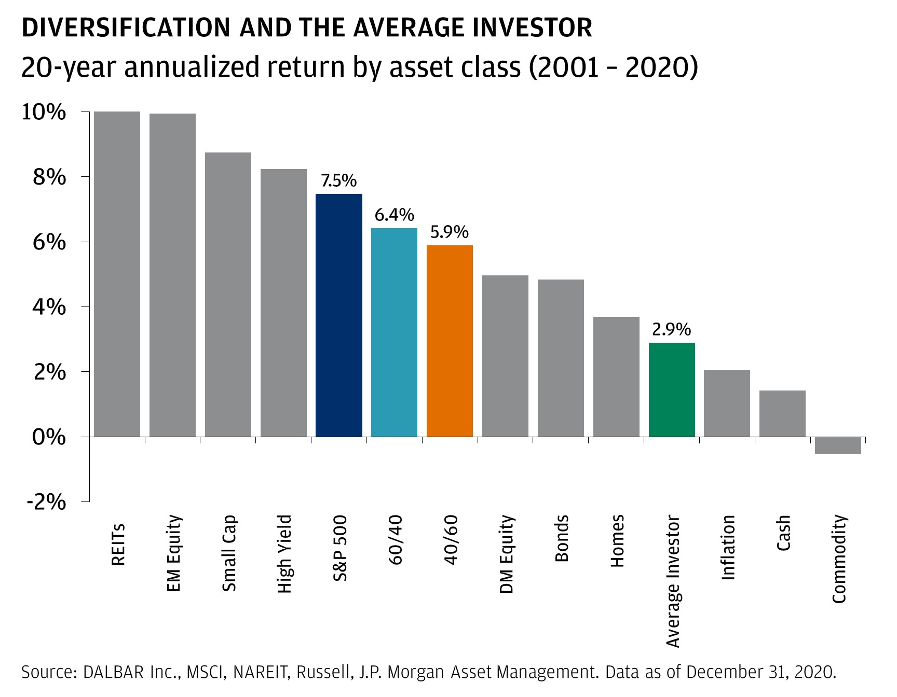
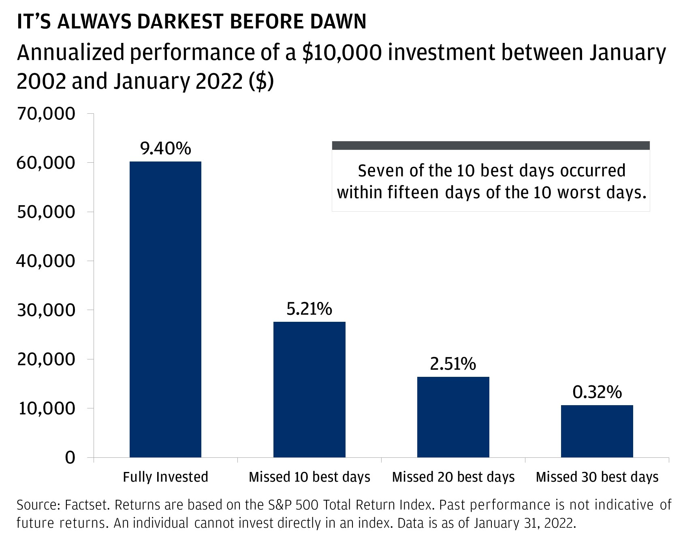

**Bottom Line Up Front (BLUF):**  Don't panic!  Selling after a drop in the stock market just locks in your losses.  When the market drops, stocks go on sale.  The stock market has historically always recovered and more.  Recommend holding your current stocks, and then buying more while they are cheap!  

-------

*Note: I am not a financial advisor, and I'm definitely not your financial advisor.  If you have the means to do so, seeking help from a fee-only financial advisor about your personal financial situation can make a huge difference.  However, learning how to invest can help you protect your family's own finances.*  

--------

#### Don't Panic!

If you are like me, you get a sinking feeling in your gut when the market drops.  When I first started investing, I would anxiously check my investment balance every day.  When it went up 1%, I felt like a genius.  When it went down 1%, I felt sick to my stomach and I started looking longingly at the sell button.

What I've learned from nearly every investing book ever printed is this: ignore the day-to-day fluctuations and stay invested for the long term.  

It's easier said than done.  This is real money, and you are losing it... aren't you?  

Not really.  The truth is, if the value of the market goes down, you haven't actually lost anything.  If you had 100 shares of an index fund, you still have 100 shares.  It's just that the current sale price of those shares is lower.  But, if you don't need to sell soon, does that matter?

I say no.  Better yet, if you want to buy more shares, they just went on sale.  

-----------

#### Why You Shouldn't Sell (if you believe in the market)

J.P. Morgan recently released an article in February 2022 called "[The case for (always) staying invested](https://www.jpmorgan.com/wealth-management/wealth-partners/insights/the-case-for-always-staying-invested)."  It makes the point that most investors are their own worst enemy.  For example, they show that most investors underperformed S&P 500 index (2.9% vs. 7.5%) and even a conservative 60/40 split of stock/bond index funds (2.9% vs. 6.4%).  Though the article primarily highlights that investors do not diversify enough (by failing to use index funds), market timing also affects these poor returns.

[Source](https://www.jpmorgan.com/wealth-management/wealth-partners/insights/the-case-for-always-staying-invested)

Furthermore, this article shows - as do several other investing books - that exiting the market for just a few days can greatly cut your investment profits.  In the chart below, it shows that (over the last 20 years) that being fully invested in the S&P index would've earned you a 9.4% return.  **However, just missing the 10 best days in the market would've cut your return by _nearly half_ to 5.21%.**  

[Source](https://www.jpmorgan.com/wealth-management/wealth-partners/insights/the-case-for-always-staying-invested)

The stock market dips and rises randomly from day to day.  Though a handful of lucky people might exit the market just before one downturn and re-enter before the next upswing, almost everyone who tries will fail.  Worse, [no one can time the market consistently](https://hemmingwm.com/our-services/timing-the-markets).  **Because we are unable to know the future, trying to time the market can cost you.**  

#### What works for most people

If you don't need your money yet, in principle it is best not to sell when the market drops. Instead, **stick to your plan and continue to invest regularly.**  If you have a good long-term strategy, understand that your focus isn't the day-to-day changes in the market, but instead on building wealth over a lifetime.

Personally, I'd also suggest not checking your investment balances every day (or even every month).  Studies show that we [feel the emotional pain of losses twice as intensely as the pleasure from gains](https://www.behavioraleconomics.com/resources/mini-encyclopedia-of-be/loss-aversion/#:~:text=Loss%20aversion%20is%20an%20important,as%20the%20pleasure%20of%20gaining.).  So, don't torture yourself and know this is all part of the journey.  

------------

J.P. Morgan's article is an excellent read, and details even more reasons why it is smart to continue investing through this current downturn.  For more information, you can read it here: "[J.P. Morgan - The case for (always) staying invested](https://www.jpmorgan.com/wealth-management/wealth-partners/insights/the-case-for-always-staying-invested)."

------------

#### P.S. A Warning about Crypto: These rules don't always apply

If you go to any crypto subreddit, you'll see similar appeals to "HODL" (Hold On for Dear Life) and to always "buy the dip".  However, there is a serious difference between individual cryptocurrencies and diversified index funds.  Like with individual stocks (but worse), buying more of the same crypto does not always pay off.  With the insane upside of crypto comes insane risk.  Part of this is because, unlike stocks or index funds, cryptocurrencies do not represent a portion of a company.  Without underlying assets or profits, nothing makes it more likely that a cryptocurrency will recover its previous value.

Unlike crypto, stocks have inherent value.  Their values are based on the assets, debts, and perceived profitability of an actual companies.  Better yet, index funds buy a diverse group  Crypto prices do not share this fundamental financial basis.     

