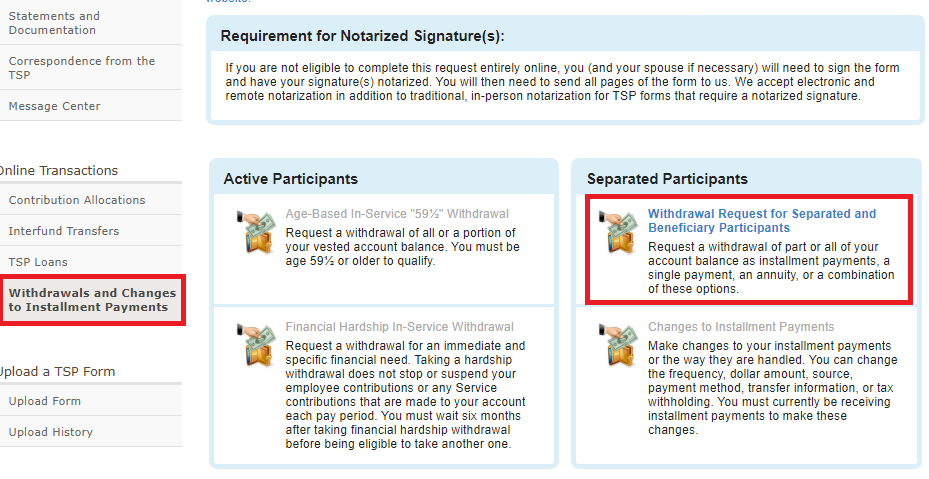

*Bottom Line Up Front (BLUF):* It depends... but probably.  Rolling over to an IRA and/or Roth IRA gives you flexibility.  You can buy different investments and can even rollover funds from your IRA to a Roth IRA (for more tax-free growth).  There are also significant benefits to rolling over your Roth TSP to a Roth IRA.  However, the main question is... is the risk of making more emotional investment decisions on your investments that kill your return? 

One of the biggest investing decisions that separating/retiring military members make is whether to leave their money in the Thrift Savings Plan (TSP) or not.  After you retire/separate you can transfer your TSP funds into an Individual Retirement Account (IRA) or Roth IRA.  Though the path of least resistance is to leave your TSP alone, there are real benefits to rolling your investments into an IRA or Roth IRA.

### What does a TSP Rollover Mean?

What is a TSP Rollover?  It is a transfer of funds from your TSP into a retirement account, such as an IRA or Roth IRA.  Instead of only being able to invest in the TSP's five funds, you can buy individual stocks, index funds, Real Estate Invesment Trusts (REITs), and more.  

--------

### How does a TSP Rollover Work?

My wife separated years ago and had a TSP, and we opted to roll over her TSP to Schwab in November 2021.  We followed these steps:

1. Contact your brokerage (e.g. an investment company like Schwab, Fidelity, Vanguard, etc.), if you have one.  For us, we called Schwab's help desk and asked what the process was.  They told us that we just needed to send them the form TSP-99, signed and notarized, and they would handle the rest.

2. [Log into TSP](https://www.tsp.gov/), then click on "Withdrawls and Changes to Installment Payments" (on the left side) and then the "Withdrawal Request for Separated and Beneficiary Participants" link 

3. Answer the questions in the online tool to generate your TSP-99 Web form.  For us, we opted to transfer 100% of my wife's traditional TSP to an IRA, and 100% of her Roth TSP balance to a Roth IRA.

4. Open an IRA (if transferring from traditional TSP) or Roth IRA (if transferring from Roth TSP)... or both if needed.  _If you don't already have a brokerage, you'll need to find one to start working with.  I'd suggest a low-cost investment company like Schwab, Fidelity, or Vanguard._

5. Sign the paperwork (in front of a notary, like at the bank), and submit Paperwork to brokerage to be processed.  Your process may vary, so ensure you follow your 

6. Wait for your funds to be distributed.  In our case, this is how it was distributed:
- Traditional TSP balance -> Transferred directly into IRA
- Roth TSP balance -> Transferred directly into Roth IRA
- Tax-free balance (from deployment) -> A check mailed to us

---------

## Reasons to rollover your TSP:

### _Transfer:_ IRAs give you more investing options

One of the biggest benefits of an IRA is that it gives you a _ton_ more investing options than TSP.  The TSP only gives you five funds ([and will eventually charge you a lot of fees to invest in other mutual funds](https://www.militaryinvestor.org/TSP-New-Mutual-Funds/)).  In an IRA, you can buy individual company stocks, index mutual funds, Real Estate Investment Trusts (REITs), etc.  More options creates greater flexibility and more control over your financial future.

----------

### _Transfer:_ You can rollover funds from TSP to an IRA, and then from your IRA to a Roth IRA

Most military members - and especially enlisted - are in an extremely low tax bracket.  This is because BAH/BAS pay is not taxed.  Because of this, most military members should be investing in Roth options, either Roth TSP or Roth IRAs.

Why?  Though investing in a Roth TSP or Roth IRA does not give you a tax write-off (like traditional TSP or IRA does), it allows your investments to grow tax free.  This means that, if you invest a $6,000 once for 30 years at a 7% return, the $38,928 of growth is all _tax free_.  That's better than getting $6,000 tax write-off (and maybe getting ~20% of that back).  

However, not all of us invested in Roth TSP early in our careers (I didn't).  And, you can't move money between traditional TSP and Roth TSP, either.  But, if you rollover from TSP to an IRA... you can then do another rollover from your IRA to a Roth IRA.

The catch?  You add the amount you transfer from your IRA to a Roth IRA as income (which raises your taxes).  But, it sets you up for a lot more tax-free gains in the long run.

Also, there are a lot of benefits that Roth IRAs have over either a TSP or Roth TSP.

----------

### _Transfer:_ Roth IRAs give you extra benefits over TSP or Roth TSP

Why is moving your investments into a Roth IRA better than the alternatives?  A Roth IRA gives these benefits:

- **Roth IRA investments grow tax free.**  (Roth TSP investments do, too.)

- **Contributions to a Roth IRA can be withdrawn without taxes or penalties.**  You can withdraw the money you put into your Roth IRA (but not any investment gains) without paying taxes or penalties.  Though you shouldn't do this, it's nice to have the flexibility just in case.

- **There are no Required Minimum Distributions (RMDs) for Roth IRAs.**  Unlike TSP/Roth TSP and IRAs, Roth IRAs do not require you to take RMDs when you reach retirement age.  This means that, if you don't need the money in retirement, you can let your investments grow longer.   

-------

## Reasons _not_ to rollover your TSP:

### _Don't Transfer:_ If you aren't able to withstand a market downturn emotionally, leave your TSP alone

Why?  Transferring to an IRA or Roth IRA allows you to buy and sell investments very quickly, which makes it easier to change your investments.  This also has the bad side effect of making it easier to make bad decisions based on emotion.

To decide if this is a problem for you is to judge how you are reacting to the current market volitility.  If you are investing each month and still sleep easily at night, then rollover your TSP.  If you are constantly fighting the urge to transfer everything to the G Fund (or if you already did), then don't.  Statistically, you are going to lose when attempting to _time the market_.  Leaving your investments in TSP makes it harder to make these types of mistakes, though not impossible.  

--------

### _Don't Transfer:_ If you want to keep your investing as simple as possible, leave your TSP alone

Leaving your TSP alone is the easiest route.  Rolling over your TSP takes a little work (a few phone calls, printing/signing documents, etc.).  Also, TSP's five funds makes investing very simple compared to an IRA, where you can buy nearly any stock, ETF, or mutual fund.  

You won't be able to put more money into your TSP after you retire or separate.  However, leaving your TSP alone will allow that amount of your investments to continue to grow undisturbed.  You'll still want to open a separate IRA or Roth IRA for new investments, though.

-----------------------

## Conclusion

Overall, whether to rollover your TSP into an IRA or Roth IRA after you separate or retire is a personal decision.  However, for many people, doing so gives you some added flexibility that you may wish you had in the future.  