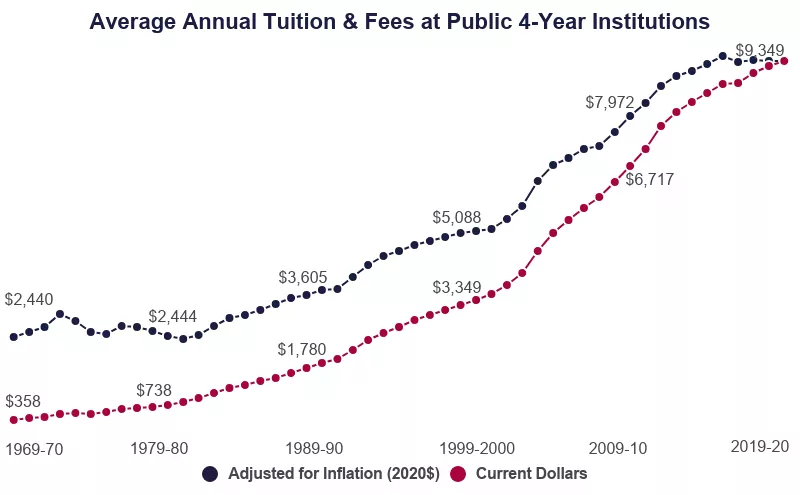

*Bottom Line Up Front (BLUF):* College is getting more expensive every year, but a degree opens many doors (especially after the military).  Earn it for free while serving with Tuition Assistance (TA).  Then, transfer your Montgomery GI Bill (MGIB) to your family or current family.

-------

College is crazy expensive, and is getting more expensive.  A combination of greater demand, increased federal aid, and decreased state funding has created accelerating growth in college prices, especially over the last 20 years.  Though it seems that this growth is slowing (for now), college tends to be one of the largest costs that Americans face.

The average annual cost of undergrad tuition and fees has risen from $3,706/year in 2000 to an outstanding $9,403/year in 2020!  **That is a 250% increase in 20 years!**  

Source: [Education Data Initiative](https://educationdata.org/average-cost-of-college-by-year)

However, military members have a *huge* advantage in this area.  We have Tutition Assistance (TA) and the Montgomery GI Bill (MGIB) to pay for our college educations.  Better yet, military members who plan ahead can get their own college paid for by TA, and transfer their Montgomery GI Bill to their kids.  **But, you must plan ahead, especially to transfer your benefits!**

> For some of you, you already know all of this.  However, I'm often surprised by the number of people who just don't know this information yet.  

---------

## Why should I get my college degree?

Ok, so we should probably start by outlining why you need a degree in the first place.  The big reason is to create better opportunities for yourself after the military.

As I've started my transition from the Air Force, my job search revealed something: most high-paying *knowledge jobs* (remote jobs and office work, but not trades) require a bachelor's degree, and many even prefer a master's degree.  Having these degrees will not automatically get you the job, but not having it could eliminate you from many opportunities.

In addition, college education often helps with promotion while you are serving.  In the Air Force, college education is heavily weighted, especially for promotion into senior ranks, as proof of personal growth and self-improvement.  Whether you agree or disagree that this *should* impact promotion, it doesn't change the fact that it does impact promotion.  

Furthermore, there are the actual benefits of gaining knowledge through formal study.  There are alternatives to a traditional college education, like industry certifications and online learning platforms.  However, an education with a good university is also a good option to grow foundational knowledge in your field. 

So, if you are convinced that you should get a degree, then let's talk about how you can get it paid for free.

--------

## Step 1. Using Tuition Assistance to Get Your College Degree(s) for Free

Tuition Assistance (TA) allows officers, warrant officers, and enlisted active-duty service members to get up to 100% of your college costs paid.  (National Guard and Reserves might be eligible too, depending on their situation.)  TA pays for up to $250 per semester hour or $166 per quarter credit hour, and up to $4,500 total each year.

Why is this important?  Because, there are dozens of colleges (including some large colleges) that only charge military members $250 per semester credit hour.  **By studying through these colleges, you can effectively get your college degree(s) paid for 100%.**  You just pay for your text books.

This is not a comprehensive list, but (as of this writing) here are a few of the schools that offer military rates:
- [University of Louisville](https://louisville.edu/online/tuition?tab=military)
- [University of Maryland Global Campus (UMGC)](https://www.umgc.edu/tuition-financial-assistance/tuition)
- [Park University](https://www.park.edu/military/#:~:text=Understand%20Your%20Benefits&text=We%20offer%20a%20discounted%20tuition,hour%20for%20currently%20serving%20students.)

Through these and other quality schools, you can earn your college degree while on active duty and save your Montgomery GI Bill.  Why would you do this?  To transfer to your current (or future) family.

-----------

### But... I don't have time to go to college!

In talking with folks, I hear this often.  And, in some cases, they are right.  However, in my opinion, most people have lots of unaccounted for time in their lives.  They spend hours *doom scrolling* through social media and binging shows on Netflix after work, but spend very little of their time developing themselves. 

For those who are on the fence, I always recommend: Do just one class.  

You start with one, because once you get used to that first class... you'll find the time for it in your life.  And, once you finish that class, you'll likely feel obligated to yourself to take the next one.  And finally, learning will just become something that you do.

-----------

## Step 2. Transfer Your Montgomery GI Bill (MGIB) to Give Your Spouse/Kid(s) Free College, too!

Thanks to your military service, you get college for free.  But, what about your current (or future) family?  Paying for their children's college education is a major financial goal for many families, but can feel totally out of reach.

Military members have an advantage here, too... by transferring your Montgomery GI Bill (MGIB) college benefits to their spouse or children.  It pays for [36 months of college tuition and feeds, a monthly housing allowance, and a stipend for textbooks and supplies](https://www.militarytimes.com/education-transition/2019/07/20/gi-bill-benefits-guide/#:~:text=The%20Post%2D9%2F11%20GI%20Bill%20is%20a%20generous%20education,for%20up%20to%2036%20months.).  You can give it all to one person, or split it between multiple family members.

**However, transferring your MGIB benefits requires you to reenlist at a certain time in your career.**  In the Air Force, you must have served at least 6 years, **[but no more than 16 years](https://www.af.mil/News/Article-Display/Article/1842904/changes-to-post-911-gi-bill-transfers-effective-july-2019/#:~:text=Effective%207%2F12%2F2019%2C,before%207%2F12%2F2019.)**. This means that if you wait too long (at least in the Air Force), you won't be able to transfer your benefits.

If you complete your college degree(s) using Tuition Assistance, then transferring your MGIB benefits to your spouse or kid(s) is a huge benefit worth tens of thousands of dollars.  It can help give them a faster start to life without the huge financial strain of college loan debt.  

-----------

### What if I have multiple kids?

If you have multiple kids... you could hope that the rest are either really smart or really dumb?  (Kidding!)  Your Montgomery GI Bill only covers 36 months of benefits.  If you have more kids, you have to do something else.

First, I recommend not to sacrifice your retirement savings to save for college.  **Pay yourself first.**  However, once you are investing enough to protect your own financial future, then you have lots of options to save for your children's education.

I covered this in a previous article entitled, ["How to Save for College - ESA vs. 529 Plans"](https://www.militaryinvestor.org/How-To-Save-For-College-ESA-vs-529/).  But, tax-advantaged investing programs like 529 plans & Education Savings Accounts (ESAs) can help allow you to save and invest in your children's futures.

-------------

## Conclusion:

Just by using your military education benefits, you can save yourself and your family tens of thousands of dollars.  As I like to say, it is "free chicken".  Or rather, it is a benefit that you are paying for with your blood, sweat, and tears.  So, take advantage of this benefit so you can better prepare yourself and your family for a better future.